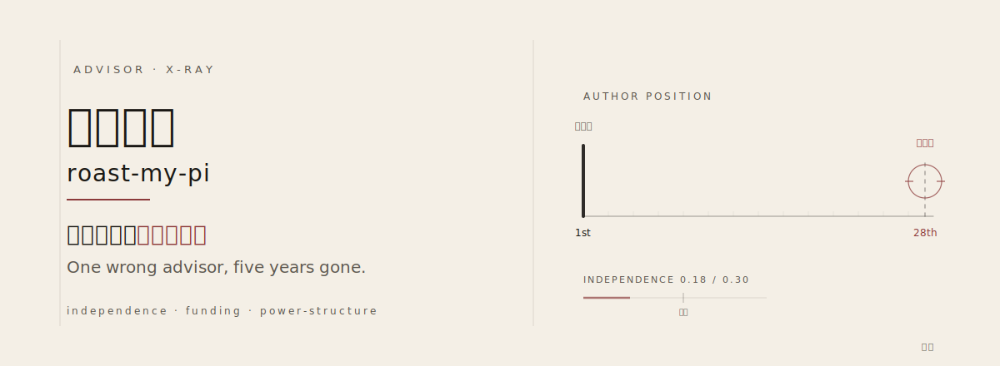

<picture>
  <source media="(prefers-color-scheme: dark)" srcset="hero.svg">
  
</picture>

<div align="center">

**导师锐评 · Data-driven advisor X-ray**

用数据看清一位导师的真实科研画像，而不是看头衔和机构光环。


**[中文版](#中文版)** ｜ **[English](#english)**

</div>

---

> Nature 一作 ≠ Nature 第 28 作者。
>
> 署名位置、基金归属、合作权力结构 —— 这三件事，决定一个导师是真 PI，还是团队挂件。

**这个工具只做一件事：** 把一位潜在学术导师的论文、基金、合作网络拆开看，剥掉机构光环和团队荣誉，告诉你他**自己**到底做了什么。

| 独立性比率 | 基金归属 | 合作权力结构 |
|:---:|:---:|:---:|
| **一作 / 通讯** vs **挂名** | **自己拿的** vs **蹭的** | **Boss** vs **平级 / 学生** |
| `0.30` 是独立 PI 的门槛 | 面上项目才算独立 | 看谁真正拥有课题 |

---

## 中文版

<details open>
<summary><b>避坑指南：6 条识破注水导师</b></summary>

> 每一条都能截图单发。读完你不会再被简历唬住。

### 1. 看作者位置，别看期刊影响因子

Nature 一作不等于 Nature 第 28 作者。署名位置才是真实贡献度：第 20+ 作者通常只贡献了样本，不等于科研能力。盯住一作和通讯论文的数量与质量。

| 同样是 Nature | 含金量 |
|:---|:---|
| 第 1 作者 / 通讯 | 真本事，主导了这项工作 |
| 第 3–5 作者 | 有实质参与 |
| 第 20+ 作者 | 递了点样本 |

### 2. 独立性比率 < 0.15，基本不是独立 PI

把所有论文按署名角色打分：

| 角色 | 权重 |
|:---|:---|
| 一作 | +1.0 |
| 通讯（末位 + 通讯标记）| +1.0 |
| 共同一作 | +0.7 |
| 共同通讯 | +0.5 |
| 中间作者 | +0 |

```
独立性比率 = 加权得分 / 论文总数
```

- `> 0.30` 可信的独立研究者
- `0.15 – 0.30` 独立性发展中
- `< 0.15` 团队螺丝钉，大概率不是独立 PI

### 3. 通讯作者才是真 PI，末位作者可能只是挂名

很多人把最后一位作者当 PI，但通讯作者标记才是金标准。

- 末位 + 通讯标记 = 真 PI（权重 1.0）
- 共同通讯（非末位）= 半个 PI（权重 0.5）
- 末位但无通讯标记 = 可能只是资深挂名

要看清谁真正拥有这个课题。

### 4. 查基金归属，不是看致谢里有没有基金号

论文致谢里出现基金号，不等于这是他的基金。

交叉验证方法：搜索所有用了这个基金号的论文，看谁在这些论文里当通讯。如果全是别人通讯的论文在致谢，他只是蹭了课题组成员的基金。

> 一个基金号的"主人"，是在该基金号论文中反复担任通讯的那个人。

### 5. 只有青年基金 + 院内课题，大概率万年主治

NSFC 基金类型直接暴露职业阶段：

| 基金类型 | 编号前缀 | 含义 |
|:---|:---|:---|
| 青年项目 | `8xxxxxx` | 入门级，约 21 万，新人的起点 |
| **面上项目** | `3xxxxxx` | **独立 PI 的门槛**，约 55 万 |
| 优青 | `2xxxxxx` | 精英级，约 200 万 |
| 重点项目 | `7xxxxxx` | 资深 PI，约 300 万 |

一个人发了很多年论文，却从没拿过面上项目，大概率是永久主治医师，不是独立研究者。

### 6. 跟了同一个 Boss 八年还在中间位置，就是天花板

看合作网络的权力结构：

- 长期固定跟同一位大牛合作、且始终是中间作者，说明从未发展出独立方向。
- 有没有不带 Boss 独立发的论文？这才是真正的独立信号。
- 独立性的轨迹比当下状态更重要：是在上升，还是已经停滞。

</details>

<details open>
<summary><b>这是什么</b></summary>

**roast-my-pi（导师锐评）** 是一个 Hermes Agent 技能，系统性地客观评估一位潜在学术导师的真实科研画像：剥离机构光环、虚高头衔、团队荣誉，揭示个人的实际独立贡献。

核心原则只有一条：数据胜于声誉，证据胜于修辞。

</details>

<details open>
<summary><b>它能告诉你什么</b></summary>

- 这个人是真正的独立 PI，还是平台依赖型贡献者
- 实际发文独立性比率，对比团队挂名比率
- 名下到底有没有独立基金（不是蹭的）
- 合作网络中的真实权力位置（Boss / 平级 / 学生）
- 职业轨迹是上升、停滞、还是已经触顶
- 你加入他的组，竞争力和发展前景如何

</details>

<details open>
<summary><b>锐评示例</b></summary>

> 合成案例声明：本报告基于真实学术评估模式虚构，所有数据为演示用，不代表任何真实个人。

### 导师锐评报告 · 示例导师

机构：某高校附属医院 ｜ 数据来源：PubMed 常见论文模式

---

**独立性评分 `0.18`**　团队挂件，非独立 PI　（独立 PI 门槛为 0.30）

**署名角色分布**

| 角色 | 占比 |
|:---|:---|
| 一作 | 约 5–10% |
| 通讯 | 5% 以下 |
| 中间作者 | **约 80%** |
| 大型合作组（>20 人）| 约 10% |

**期刊质量分布**

| 层级 | 情况 |
|:---|:---|
| T1 精英（IF > 15）| 数篇，但均为中间作者 |
| T2 顶级（IF 8–15）| 若干篇 |
| T3–T4（IF 2–8）| 大部分，一作集中于此 |
| T5 低端 / 掠夺性 | 存在 |

**基金归属**

| 类型 | 状态 |
|:---|:---|
| NSFC 青年项目 | 1 项，已结题 |
| NSFC 面上项目 | **无** |
| 院内课题 | 少量 |

仅青年基金，万年主治风险。

**合作网络权力结构**

| 指标 | 结果 |
|:---|:---|
| 核心 Boss | 出现在约 80% 论文，末位 |
| 本人相对位置 | 长期 5–8 / 10–15 位 |
| 独立发文（无 Boss）| 几乎没有 |

---

> **总体判断**：该研究者长期作为某大牛团队的核心中间作者，发表了大量高 IF 论文，但几乎从不担任一作或通讯。独立性比率 0.18 远低于独立 PI 门槛 0.30，基金仅有青年项目，从未获得面上项目。不具备独立指导博士生的条件。

</details>

<details open>
<summary><b>快速开始</b></summary>

```bash
# 在 Hermes Agent 中加载技能
skill_view(name='advisor-insight')

# 然后按引导流程操作
```

需要准备的信息：

- 导师全名（中英文）+ 别名
- 当前机构 + 科室
- 职称（如已知）
- ORCID（如有，金标准）
- 已知合作者或学生
- 研究方向关键词

> 仅提供名字无法评估。至少需要机构 + 科室才能开始消歧。

</details>

<details open>
<summary><b>工作原理</b></summary>

| 阶段 | 名称 | 做什么 |
|:---|:---|:---|
| Phase 0 | 消歧 | 跨 PubMed / ORCID / Scholar / 机构官网交叉验证，确保找对人 |
| Phase 1 | 发文审计 | 抓取 PubMed 论文，逐篇分类署名角色，算独立性比率 |
| Phase 2 | 基金分析 | 解析致谢中的基金号，交叉验证基金真正归属 |
| Phase 3 | 合作网络 | 统计合作频次，绘制权力结构和学术食物链 |
| Phase 4 | 职业轨迹 | 从发文历史重建职业轨迹，判断独立性趋势 |
| Phase 5 | 综合评分 | 汇总所有维度，给出标准化评分和结论 |

</details>

---

## English

<details>
<summary><b>Red flags: 6 ways to tell an advisor is inflated</b></summary>

> Save these. Screenshot them. You'll never look at a CV the same way again.

### 1. Author position beats journal impact factor

First author on Nature is not the same as author #28 on Nature. Where you sit on the author list says everything about what you actually did. Position 20+ usually means you handed over some samples, that's it. What matters is the count of first-author and corresponding-author papers.

| Same Nature paper | What it actually means |
|:---|:---|
| 1st author / corresponding | They drove the work |
| 3rd–5th author | Meaningful contribution |
| 20+ author | Sent in some samples |

### 2. Independence ratio below 0.15, they're not a PI

Score every paper by the author's role:

| Role | Weight |
|:---|:---|
| First author | +1.0 |
| Corresponding (last + marked) | +1.0 |
| Co-first | +0.7 |
| Co-corresponding | +0.5 |
| Middle author | +0 |

```
Independence ratio = weighted score / total papers
```

- `> 0.30` a credible, independent researcher
- `0.15 – 0.30` building independence, not there yet
- `< 0.15` a bench hand, not a lab head

### 3. "Last author" isn't the same as "PI"

People assume the last name on the list is the PI. The corresponding-author marker is what actually tells you.

- Last position + corresponding marker = the real PI (weight 1.0)
- Co-corresponding but not last = half the claim (weight 0.5)
- Last position, no corresponding marker = probably just the senior name on the door

Find out who actually owns the project.

### 4. A grant in the acknowledgments isn't their grant

Seeing a grant number in the footnotes doesn't mean it's theirs.

How to check: pull every paper that cites that grant ID, look at who's corresponding on those papers. If it's always someone else, they're surfing on someone else's money.

> The real owner of a grant is the person who keeps showing up as corresponding author on the papers funded by it.

### 5. Only ever held a Youth grant? They're stuck.

In the Chinese funding system, grant tier maps directly to career stage:

| Grant type | Prefix | What it means |
|:---|:---|:---|
| Youth Project | `8xxxxxx` | Entry-level, ~210K CNY, everyone starts here |
| **General Program** | `3xxxxxx` | **The minimum bar for calling yourself an independent PI**, ~550K |
| Excellent Young | `2xxxxxx` | Competitive, ~2M |
| Key Program | `7xxxxxx` | Senior PI territory, ~3M |

Someone who's been publishing for years but has never landed a General Program is likely what Chinese academia calls a "permanent attending" (万年主治): stuck at the same rank, never broke out on their own.

### 6. Eight years, same lab head, still a middle author? That's a ceiling.

Map the co-author power structure:

- If they keep publishing with the same senior PI and never move up from the middle of the list, they've never carved out their own line.
- Are there papers without the lab head? That's the real independence signal.
- The trajectory matters more than the snapshot: are they climbing, or have they flatlined?

</details>

<details>
<summary><b>What is this</b></summary>

**roast-my-pi** is a Hermes Agent skill that takes a hard, data-driven look at a potential advisor's actual research profile: cutting past institutional name-drops, puffed-up titles, and team accomplishments to show you what this person has actually done on their own.

The principle is one line: data over reputation, evidence over rhetoric.

</details>

<details>
<summary><b>What it tells you</b></summary>

- Whether they're a real, independent PI or just riding someone else's platform
- Their true independence ratio versus how often they're a passenger on other people's papers
- Whether they actually hold their own funding, or it's borrowed
- Where they really sit in the co-author hierarchy (lab head / peer / trainee)
- Whether their career is still climbing, coasting, or already topped out
- What joining their group would actually mean for your competitiveness and future

</details>

<details>
<summary><b>Sample report</b></summary>

> Synthetic case disclaimer: this report is fictional, built from real evaluation patterns. No data here refers to any actual person.

### Advisor Insight Report · Sample advisor

Institution: university-affiliated hospital ｜ Data source: common PubMed patterns

---

**Independence ratio `0.18`** — team dependent, not an independent PI (threshold: 0.30)

**Author role breakdown**

| Role | Share |
|:---|:---|
| First author | ~5–10% |
| Corresponding | Under 5% |
| Middle author | **~80%** |
| Large consortium (>20 authors) | ~10% |

**Journal quality**

| Tier | Picture |
|:---|:---|
| T1 Elite (IF > 15) | A handful, but always middle author |
| T2 Top (IF 8–15) | Several |
| T3–T4 (IF 2–8) | The bulk, first-author papers land here |
| T5 Low / predatory | Yes, some |

**Grant ownership**

| Type | Status |
|:---|:---|
| NSFC Youth Project | 1, completed |
| NSFC General Program | **Never** |
| Institutional grants | A couple |

Youth grant only, stuck at attending level.

**Co-author power structure**

| Metric | Finding |
|:---|:---|
| The lab head (Boss) | Shows up on ~80% of papers, always last |
| Where this person sits | Stuck at position 5–8 out of 10–15, year after year |
| Papers without the Boss | Almost zero |

---

> **The verdict**: this researcher has spent years as the workhorse middle author in a senior PI's lab. Plenty of high-IF papers to their name, but almost never in the driver's seat — rarely first author, almost never corresponding. Independence ratio of 0.18 sits well below the 0.30 bar for running an independent group, and they only hold a Youth Project grant, never a General Program. Not someone who can independently mentor a PhD student.

</details>

<details>
<summary><b>Quick start</b></summary>

```bash
# Load the skill in Hermes Agent
skill_view(name='advisor-insight')

# Then follow the guided workflow
```

You'll need:

- The advisor's full name (Chinese + English) and any aliases
- Current institution + department
- Title or rank (if you know it)
- ORCID, if they have one — the gold standard for nailing down identity
- Any known collaborators or former students
- Research-area keywords

> A name on its own won't cut it. You need at least institution + department before disambiguation can begin.

</details>

<details>
<summary><b>How it works</b></summary>

| Phase | Name | What happens |
|:---|:---|:---|
| Phase 0 | Disambiguation | Cross-check PubMed, ORCID, Scholar, and institution pages — make sure you've got the right person |
| Phase 1 | Publication audit | Pull every PubMed paper, classify each by author role, compute the independence ratio |
| Phase 2 | Grant analysis | Extract grant IDs from acknowledgments, trace who actually owns each one |
| Phase 3 | Co-author network | Count co-authorships, map the power structure and the lab's food chain |
| Phase 4 | Career trajectory | Reconstruct the career arc from publication history — is independence growing or stalled? |
| Phase 5 | Synthesis | Roll everything up into a standardized score and a plain-English verdict |

</details>

---

## License

MIT — free to use, modify, and distribute.

## Contributing

Contributions welcome: additional skills, improved heuristics, new data sources. Open an issue or PR.
